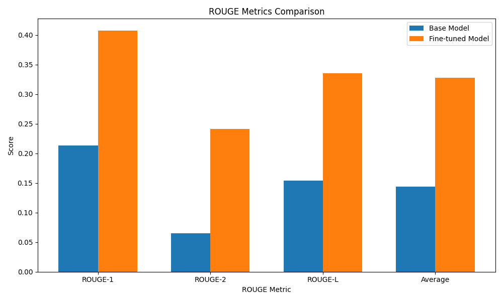
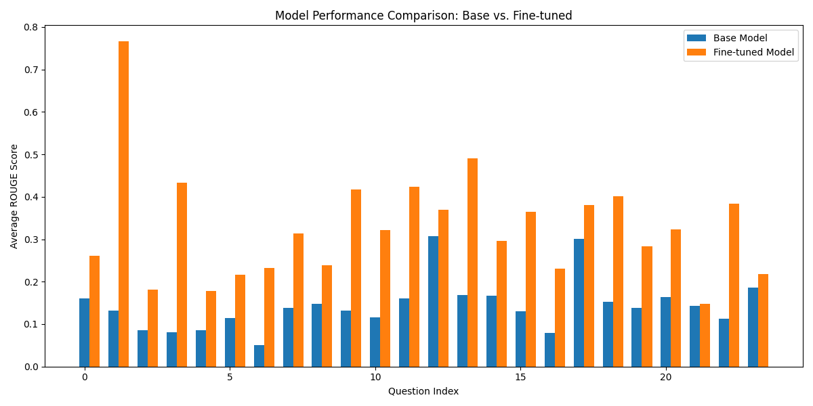

# LLM Fine-Tuning Project



## Project Overview

This project implements a comprehensive framework for fine-tuning a small Language Learning Model (LLM) using Parameter-Efficient Fine-Tuning (PEFT) techniques. The framework includes training, evaluation, and reporting components designed to work together seamlessly.

### Selected LLM

[Qwen2.5-0.5B-Instruct](https://huggingface.co/Qwen/Qwen2.5-0.5B-Instruct) - This model was selected as the foundation primarily due to its popularity and compact size, making it efficient for fine-tuning experiments.

## Architecture

### Pre-processing Steps

The framework applies necessary pre-processing to format the data appropriately for the chosen model. This includes concatenating questions and answers with specific keywords as documented in the base model's requirements:

```python
return f"<|im_start|>system\nYou are a helpful assistant.<|im_end|>\
<|im_start|>user\n{row['Question']}<|im_end|>\
<|im_start|>assistant\n{row['Answer']}<|im_end|>\n"
```

### Workflow Components

The project implements a modular workflow consisting of four primary steps:

1. **Training** (`CustomLLM/TrainLLM.py`):
   - Reads questions and answers from the dataset
   - Loads the base model
   - Applies LoRA fine-tuning techniques
   - Outputs the fine-tuned model

2. **Evaluation** (`CustomLLM/EvaluateLLM.py`):
   - Uses ROUGE Score methodology for assessment
   - Loads both base and fine-tuned models
   - Compares outputs against expected responses
   - Generates comparative metrics

3. **Reporting** (`CustomLLM/ReportLLM.py`):
   - Creates visualizations of performance metrics
   - Generates detailed HTML reports
   - Produces comparative analyses

4. **Orchestration** (`complete_flow.py`):
   - Coordinates execution of all components
   - Supports test mode for rapid iteration
   - Manages file paths and timestamps

### Key Hyperparameters

#### LoRA Parameters

| Parameter | Value | Description |
|-----------|-------|-------------|
| LORA_R | 8 | Rank of low-rank matrices in LoRA adaptation. Balances adaptation capacity and computational efficiency. |
| LORA_ALPHA | 16 | Scaling factor for LoRA updates. The effective learning rate is approximately (LORA_ALPHA/LORA_R) * LEARNING_RATE. |
| LORA_DROPOUT | 0.05 | Helps prevent overfitting by randomly deactivating neurons during training. |

#### Training Parameters

| Parameter | Value | Description |
|-----------|-------|-------------|
| LEARNING_RATE | 1e-4 | The rate at which the model parameters are updated during training. |
| BATCH_SIZE | 2 | Number of training examples processed in one forward/backward pass. |
| GRADIENT_ACCUMULATION_STEP | 10 | Number of forward passes to accumulate gradients before performing a weight update. |
| MAX_ITERATIONS | 1000 | Maximum number of training iterations. |

## Evaluation Results

The evaluation shows that the fine-tuned model consistently outperforms the base model, demonstrating the effectiveness of the fine-tuning process.



The charts above show:
1. Comparison of ROUGE metrics between base and fine-tuned models
2. Score comparison across different test questions

### Example Question Analysis

Sample question: "How many shifts is the working day divided into?"

* **Expected response:** The working day is divided into 3 shifts: morning, afternoon, and night. The shifts are structured to meet operational needs, with most of the work done in the morning and at night.

* **Base model response:** The standard for a "shift work" or "day shift" can vary significantly depending on the job responsibilities and the organization's policies, but generally speaking, a 40-hour workweek is common in most workplaces. However, some companies may have more flexible schedules that allow employees to take rest periods during their shifts.

* **Fine-tuned model response:** The working day is divided into three shifts: morning, afternoon, and night.

The fine-tuned model clearly provides a more accurate and concise response, closely aligning with the expected answer.

## Project Structure

```
├── CustomLLM/                          # Core implementation modules
│   ├── TrainLLM.py                     # Training implementation
│   ├── EvaluateLLM.py                  # Evaluation using ROUGE scores
│   └── ReportLLM.py                    # Reporting and visualization
├── models/                             # Directory for saved models
│   └── finetuned_YYYYMMDD_HHMMSS/      # Timestamped model directories
│       └── final_model/                # Final trained model files
├── results/                            # Evaluation results
│   └── YYYYMMDD_HHMMSS/                # Timestamped result directories
│       ├── rouge_metrics_comparison.png # Comparison visualization
│       ├── score_comparison.png         # Score comparison by question
│       ├── base_model_results.json      # Base model evaluation results
│       ├── finetuned_model_results.json # Fine-tuned model results
│       └── fine_tuning_report.html      # Detailed HTML report
├── ollama_build/                       # Files for creating Ollama models
├── report/                             # LaTeX report files
├── complete_flow.py                    # Orchestration script
├── KeywordsOfTokenizer.ipynb           # Notebook for model token analysis
├── report_questions.ipynb              # Notebook for model response generation
├── question_answer.csv                 # Dataset with questions and answers
└── requirements.txt                    # Required dependencies
```

## Usage Instructions

### Prerequisites

* Python 3.8+
* CUDA-compatible GPU (recommended, but CPU will work too)
* Required packages:
  ```
  torch>=2.0.0
  transformers>=4.34.0
  peft>=0.5.0
  bitsandbytes>=0.41.0
  pandas>=2.0.0
  datasets>=2.14.0
  tqdm>=4.66.0
  rouge-score>=0.1.2
  matplotlib>=3.5.0
  accelerate>=0.23.0
  sentencepiece
  ```

### Installation

1. Clone the repository:
   ```bash
   git clone https://github.com/vmchura/LLMFineTuning.git
   cd LLMFineTuning
   ```

2. Install dependencies:
   ```bash
   pip install -r requirements.txt
   ```

### Running the Framework

#### Full Workflow

To run the complete workflow (training, evaluation, and reporting):

```bash
python complete_flow.py
```

#### Test Mode

For quick testing of the workflow with reduced parameters:

```bash
python complete_flow.py -test
```

#### Specific Steps

To run specific steps in the workflow:

```bash
# Only training
python complete_flow.py train

# Only evaluation and reporting
python complete_flow.py evaluate report

# Test mode with specific steps
python complete_flow.py -test train evaluate
```

### Using the Fine-tuned Model

After training, the model can be used with the Ollama framework by following the instructions in `ollama_build/README.md`.

## Conclusions

Even with a small model and minimal training time, the fine-tuning process demonstrated measurable improvement. This represents a promising foundation for addressing more complex challenges, guided by rigorous scientific methodology throughout each experimental phase.

This project was designed with modularity in mind to facilitate straightforward adaptation to different datasets and models. The versatility of LLMs represents a disruptive force in the current technological landscape.

## License

This project is open-source and available under the MIT License.

## Acknowledgments

* This project utilizes the Hugging Face Transformers library
* ROUGE Score methodology for evaluation
* LoRA fine-tuning technique for parameter-efficient adaptation
